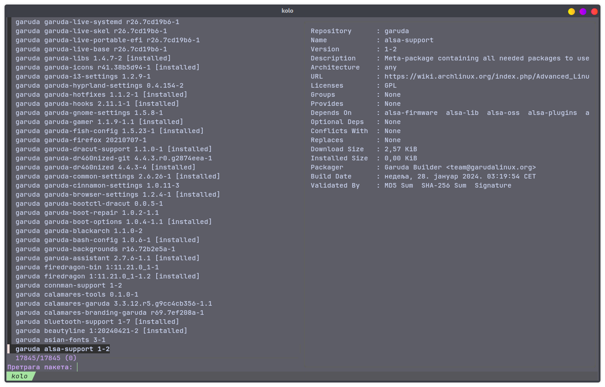
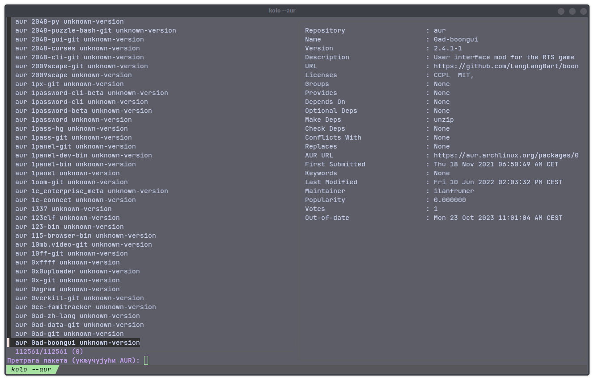

# 📻 | Kolo - Arch Package Finder

---

[Српски (🇷🇸)](README.md) | [English (🇬🇧)](README-en.md)

---

> [!WARNING]
> `kolo-en.sh` - is not actively maintained.

Interactive package finder for Arch Linux using [`fzf`](https://github.com/junegunn/fzf) to search official repositories and AUR.

---

## Usage

```bash
chmod +x kolo-en.sh
```

### Search official repos

```bash
./kolo-en.sh
```



### Search with AUR support

```bash
./kolo-en.sh --aur
```



### Sync package database

```bash
./kolo-en.sh --sync
```

### Example usage

```bash
./kolo-en.sh --aur --sync
```

### Requirements

- fzf
- AUR helper (`yay`/`paru`/`pikaur`/`trizen`/`aura`) for AUR support

```bash
sudo pacman -S --needed git base-devel fzf
git clone https://aur.archlinux.org/yay.git
cd yay
makepkg -si
```

---

<details>
<summary>Kolo - Meaning</summary>

- Kolo (game): Serbian traditional circular dance involving rhythmic movements, usually in a group.

- Electric circuit (Električno kolo): A pathway for electric current, including a power source and electronic components.

</details>

---

## Other

- [`crnobog/dotfiles`](https://github.com/crnobog69/dotfiles)

---
